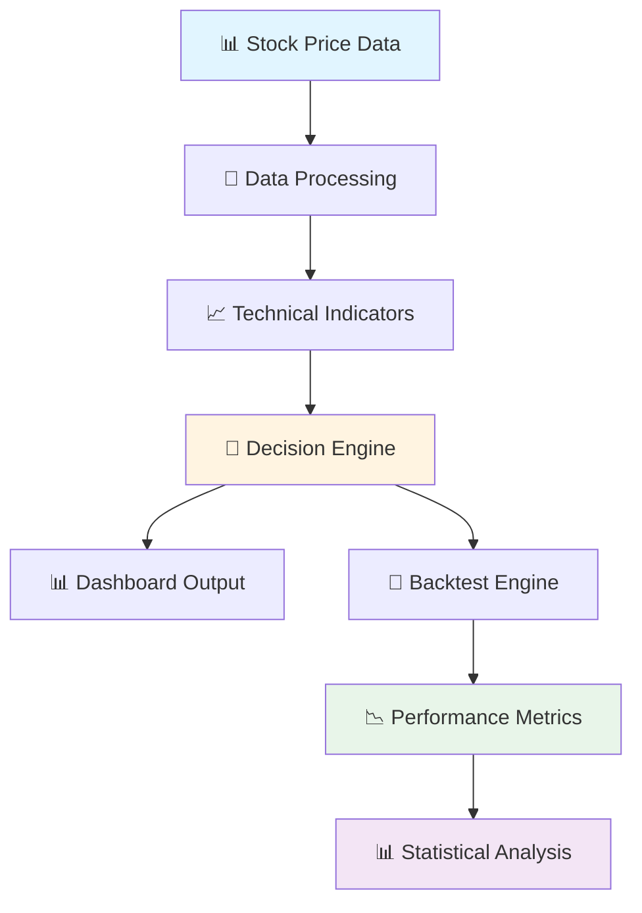

```markdown
<div align="center">

# 📊 Algorithmic Trading Strategy Dashboard

### Automated Backtesting & Performance Analytics System

[](https://sheets.google.com)
[](https://developers.google.com/apps-script)
[](https://developer.mozilla.org/en-US/docs/Web/JavaScript)

**A comprehensive trading strategy system with automated backtesting, real-time analytics, and decision-making algorithms**

[Features](#-features) • [Demo](#-live-demo) • [Installation](#-installation) • [Documentation](#-documentation) • [Results](#-performance-results)

---

</div>

## 🎯 Overview

This project implements a **fully automated trading strategy dashboard** built entirely in Google Sheets with Apps Script. It analyzes stock price data, generates buy/sell/hold signals based on technical indicators, and backtests strategies against historical data—all without requiring complex infrastructure or coding knowledge.

<div align="center">

### 🎬 Live Demo: AAPL Analysis


*Interactive analytics dashboard with real-time decision-making*

</div>

---

## ✨ Features

<table>
<tr>
<td width="50%">

### 📈 **Trading Signals**
- Real-time buy/sell/hold decisions
- Multi-condition technical analysis
- Customizable strategy parameters
- Risk assessment integration

</td>
<td width="50%">

### 🔬 **Backtesting Engine**
- Daily & weekly timeframe support
- Historical performance validation
- Statistical significance testing
- Comprehensive accuracy metrics

</td>
</tr>
<tr>
<td width="50%">

### 📊 **Visual Analytics**
- Price trend visualization
- Moving average analysis
- Volatility tracking
- Volume & RSI indicators

</td>
<td width="50%">

### 🎯 **Performance Tracking**
- Accuracy by signal type
- Confidence intervals
- Return distribution analysis
- P-value statistical validation

</td>
</tr>
</table>

---

## 🖼️ Dashboard Components

<div align="center">

### Main Analytics Interface

<table>
<tr>
<td width="50%">

<br><b>📈 Stock Price Trend</b>
<br><i>Long-term price movement</i>
</td>
<td width="50%">

<br><b>📊 Price & Moving Averages</b>
<br><i>10-day & 30-day MA comparison</i>
</td>
</tr>
<tr>
<td width="50%">

<br><b>📉 Histogram of Daily Returns</b>
<br><i>Distribution analysis</i>
</td>
<td width="50%">

<br><b>⚡ Volatility (20-day)</b>
<br><i>Risk metric tracking</i>
</td>
</tr>
<tr>
<td width="50%">

<br><b>📊 Volume vs. Date</b>
<br><i>Trading activity patterns</i>
</td>
<td width="50%">

<br><b>📈 RSI (14-day)</b>
<br><i>Momentum indicator</i>
</td>
</tr>
</table>

</div>

---

## 🧠 Decision-Making Logic

<div align="center">


</div>

The system evaluates multiple technical conditions to generate trading signals:

```
┌─────────────────────────────────────────────────────────────┐
│  Condition Evaluation Matrix                                │
├─────────────────────────────────────────────────────────────┤
│  ✓ Price above MA10 & MA30    → Strong uptrend confirmed   │
│  ✓ Price below MA10 & MA30    → Downtrend confirmed        │
│  ✓ Volatility < 20%           → Normal market conditions    │
│  ✓ Price > 52-week high       → Breakout signal            │
│  ✓ Price < 52-week low        → Reversal opportunity       │
│  ✓ Low volatility & MA10=MA30 → Consolidation phase        │
│  ✓ Strong bullish trend       → Clear upward momentum      │
│  ✓ Strong bearish trend       → Clear downward momentum    │
│  ✓ Price gap > 3%             → Watch for rebound/panic    │
└─────────────────────────────────────────────────────────────┘
```

<div align="center">

**Final Decision:** `BUY` | `SELL` | `HOLD`

</div>

---

## 📊 Performance Results

### AAPL Backtest Summary

<div align="center">


</div>

<table align="center">
<tr>
<th>Metric</th>
<th>Value</th>
<th>Interpretation</th>
</tr>
<tr>
<td><b>Overall Accuracy</b></td>
<td><code>52.88%</code></td>
<td>✅ Above baseline (45.67%)</td>
</tr>
<tr>
<td><b>Buy Accuracy</b></td>
<td><code>56.10%</code></td>
<td>✅ Strong uptrend capture</td>
</tr>
<tr>
<td><b>Sell Accuracy</b></td>
<td><code>49.41%</code></td>
<td>⚠️ Conservative downtrend</td>
</tr>
<tr>
<td><b>Hold Accuracy</b></td>
<td><code>53.66%</code></td>
<td>✅ Stable consolidation</td>
</tr>
<tr>
<td><b>Total Signals</b></td>
<td><code>208</code></td>
<td>📊 Comprehensive test</td>
</tr>
<tr>
<td><b>Correct Signals</b></td>
<td><code>110</code></td>
<td>✅ Majority accurate</td>
</tr>
<tr>
<td><b>P-value</b></td>
<td><code>0.0219</code></td>
<td>✅ Statistically significant</td>
</tr>
<tr>
<td><b>Avg Return (Buy)</b></td>
<td><code>+0.29%</code></td>
<td>📈 Positive expectancy</td>
</tr>
<tr>
<td><b>Avg Return (Sell)</b></td>
<td><code>+0.49%</code></td>
<td>📉 Drawdown avoidance</td>
</tr>
</table>

---

### 📈 Statistical Validation

<div align="center">

```
╔═══════════════════════════════════════════════════════════╗
║  CONFIDENCE INTERVALS (95%)                               ║
╠═══════════════════════════════════════════════════════════╣
║  Strategy Accuracy:    [46.10% ━━━━━━━━━━━ 59.67%]      ║
║  Baseline (Random):    [38.90% ━━━━━━━ 52.44%]          ║
║                                                           ║
║  ✅ Non-overlapping intervals = Statistical significance  ║
║  ✅ P-value: 0.0219 (2.19% chance of being random)       ║
║  ✅ Balanced Accuracy: 53.06%                            ║
╚═══════════════════════════════════════════════════════════╝
```

</div>

---

### 📋 Historical Backtest Data

<div align="center">


<br>

*Sample of backtested trades showing date, action, next return, and signal correctness*

</div>

<details>
<summary><b>📊 Click to see detailed signal breakdown</b></summary>

<br>

**Signal Distribution:**
- 🟢 **Buy Signals:** 83 (39.9%)
- 🔴 **Sell Signals:** 85 (40.9%)
- 🟡 **Hold Signals:** 41 (19.7%)

**Performance by Action:**

| Action | Count | Correct | Accuracy | Avg Return |
|--------|-------|---------|----------|------------|
| 🟢 Buy | 83 | 47 | 56.10% | +0.29% |
| 🔴 Sell | 85 | 42 | 49.41% | +0.49% |
| 🟡 Hold | 41 | 22 | 53.66% | +0.22% |

</details>

---

## 🛠️ Technical Architecture

<div align="center">



</div>

### 🏗️ System Components

<table>
<tr>
<td width="33%">

#### 📁 Data Layer
**STOCK PRICE DATA Sheet**
- OHLCV data storage
- Moving averages (10/30-day)
- Technical indicators
- RSI & volatility calcs

</td>
<td width="33%">

#### 🎛️ Logic Layer
**Apps Script Engine**
- Signal generation
- Condition evaluation
- Backtesting algorithms
- ISO week calculations

</td>
<td width="33%">

#### 📊 Presentation Layer
**Dashboard Sheet**
- Visual analytics
- Real-time charts
- Decision matrix
- Performance metrics

</td>
</tr>
</table>

---

## 💻 Code Highlights

### Signal Generation Algorithm

```javascript
function normalizeAction_(decision) {
  const d = String(decision).toLowerCase();
  if (d.includes('sell')) return 'Sell';
  if (d.includes('buy'))  return 'Buy';
  return 'Hold';
}
```

### ISO Week Calculation (for Weekly Backtesting)

```javascript
function isoWeekKey_(date) {
  const d = new Date(date.getTime());
  d.setHours(0,0,0,0);
  
  // Thursday of current week
  d.setDate(d.getDate() + 3 - ((d.getDay()+6)%7));
  
  const week1 = new Date(d.getFullYear(), 0, 4);
  const weekNo = 1 + Math.round(((d - week1)/86400000 - 3 + 
                 ((week1.getDay()+6)%7))/7);
  
  return d.getFullYear() + '-' + ('0'+weekNo).slice(-2);
}
```

### Backtesting Loop

```javascript
function runBacktestWeeklyOneTicker() {
  // 1) Read full daily series
  const table = dash.getRange('AA3:AB100000').getValues();
  const days = [];
  
  for (let i=0; i<table.length; i++) {
    const d = table[i][0];
    const px = table[i][1];
    if (!isDate_(d)) break;
    if (d < startDate || d > endDate) continue;
    if (typeof px !== 'number') continue;
    days.push([d, px]);
  }
  
  // 2) Reduce to weekly endpoints
  const weekly = pickWeeklyEndpoints_(days);
  
  // 3) Replay and log decisions
  for (const [d, px] of weekly) {
    dash.getRange('C24').setValue(d);
    c25.setValue(px);
    SpreadsheetApp.flush();
    
    const decision = String(dash.getRange('E16').getValue() || '').trim();
    const action = normalizeAction_(decision);
    buffer.push([d, tkr, px, action]);
  }
}
```

---

## 🚀 Getting Started

### Prerequisites

<div align="center">


</div>

### 📥 Installation

```bash
# Step 1: Copy the Template
File → Make a copy

# Step 2: Set up your data source
# Use Google Finance function in STOCK PRICE DATA sheet:
=GOOGLEFINANCE("AAPL","all",DATE(2022,1,1),TODAY())

# Step 3: Configure Dashboard
# Navigate to Dashboard sheet and enter:
# - Ticker symbol (Cell C19)
# - Start date (Cell C21)
# - End date (Cell C24)

# Step 4: Enable Apps Script
Extensions → Apps Script
# Authorize when prompted
```

### ⚡ Quick Start

<table>
<tr>
<td width="50%">

#### 🔥 Run Weekly Backtest
```
1. Open menu: Backtest → Run WEEKLY
2. Wait 10-30 seconds
3. View results in Backtest sheet
```
**Recommended for initial testing**

</td>
<td width="50%">

#### 📊 Run Daily Backtest
```
1. Open menu: Backtest → Run DAILY
2. Wait 2-5 minutes
3. Review detailed results
```
**Comprehensive analysis**

</td>
</tr>
</table>

---

## 🎨 Customization Guide

### Adjusting Strategy Parameters

<details>
<summary><b>📈 Moving Average Periods</b></summary>

<br>

Currently configured for:
- **MA10:** 10-day simple moving average
- **MA30:** 30-day simple moving average

To modify:
1. Navigate to `STOCK PRICE DATA` sheet
2. Locate MA calculation columns
3. Update the period parameter in the formula
4. Common alternatives: 20/50, 50/200 (golden cross)

</details>

<details>
<summary><b>⚡ Volatility Window</b></summary>

<br>

Current setting: **20-day rolling window**

To adjust:
1. Find volatility calculation column
2. Modify the STDEV range parameter
3. Consider: 10-day (short-term), 30-day (medium-term)

</details>

<details>
<summary><b>📊 RSI Period</b></summary>

<br>

Current setting: **14-day RSI**

To customize:
1. Locate RSI calculation in data sheet
2. Adjust the period in the formula
3. Alternative periods: 7 (sensitive), 21 (smooth)

</details>

### Adding New Trading Conditions

```
1. Navigate to Dashboard condition matrix
2. Add new row with condition formula
3. Define action (Buy/Sell/Hold/No Action)
4. Specify trigger reason
5. Re-run backtest to validate
```

---

## 📚 Understanding the Metrics

### 🎯 Accuracy Metrics

<table>
<tr>
<th>Metric</th>
<th>Formula</th>
<th>Interpretation</th>
</tr>
<tr>
<td><b>Overall Accuracy</b></td>
<td><code>Correct Signals / Total Signals</code></td>
<td>How often predictions were right</td>
</tr>
<tr>
<td><b>Signal-Specific</b></td>
<td><code>Correct [Buy/Sell/Hold] / Total [Type]</code></td>
<td>Performance by action type</td>
</tr>
<tr>
<td><b>Balanced Accuracy</b></td>
<td><code>Mean(Buy%, Sell%, Hold%)</code></td>
<td>Accounts for class imbalance</td>
</tr>
</table>

### 📊 Statistical Metrics

<div align="center">

| Metric | Meaning | Good Value |
|--------|---------|------------|
| **P-value** | Probability results are random | < 0.05 |
| **Confidence Interval** | Range of true accuracy | Narrow & high |
| **Avg Return** | Expected return per signal | Positive |

</div>

---

## ⚠️ Important Disclaimers

<div align="center">

### 🚨 Read Before Using 🚨

</div>

<table>
<tr>
<td width="33%">

#### ⚖️ Legal
**Not Financial Advice**
- Educational purposes only
- No guarantee of profits
- Past ≠ future performance
- Do your own research

</td>
<td width="33%">

#### 🔍 Limitations
**Known Issues**
- Lookback bias potential
- No transaction costs
- Survivorship bias
- Overfitting risk
- Market impact ignored

</td>
<td width="33%">

#### 🛡️ Risk Management
**Trading Risks**
- Can lose entire investment
- Markets are unpredictable
- Use stop losses
- Diversify portfolio
- Size positions properly

</td>
</tr>
</table>

<div align="center">

```
╔════════════════════════════════════════════════════════╗
║  ⚠️  NEVER RISK MORE THAN YOU CAN AFFORD TO LOSE  ⚠️   ║
╚════════════════════════════════════════════════════════╝
```

</div>

---

## 🔮 Roadmap & Future Enhancements

<table>
<tr>
<td width="50%">

### 🎯 Planned Features
- [ ] Machine learning integration
- [ ] Multiple timeframe analysis
- [ ] Portfolio-level backtesting
- [ ] Sharpe ratio calculation
- [ ] Maximum drawdown tracking
- [ ] Walk-forward optimization
- [ ] Monte Carlo simulation

</td>
<td width="50%">

### 💡 Ideas Welcome
- [ ] Alternative indicators (MACD, Bollinger)
- [ ] Fundamental analysis factors
- [ ] Real-time alert system
- [ ] API data integration
- [ ] Web interface
- [ ] Multi-asset support
- [ ] Options strategy testing

</td>
</tr>
</table>

---

## 📖 Resources & Learning

<div align="center">

### 📚 Educational Materials

</div>

<table>
<tr>
<th>Topic</th>
<th>Resource</th>
<th>Level</th>
</tr>
<tr>
<td>📈 Moving Averages</td>
<td><a href="https://www.investopedia.com/terms/m/movingaverage.asp">Investopedia Guide</a></td>
<td>Beginner</td>
</tr>
<tr>
<td>📊 RSI Indicator</td>
<td><a href="https://www.investopedia.com/terms/r/rsi.asp">RSI Explained</a></td>
<td>Beginner</td>
</tr>
<tr>
<td>⚡ Volatility</td>
<td><a href="https://www.investopedia.com/terms/v/volatility.asp">Understanding Volatility</a></td>
<td>Intermediate</td>
</tr>
<tr>
<td>📉 Backtesting</td>
<td><a href="https://www.investopedia.com/articles/trading/05/030205.asp">Common Pitfalls</a></td>
<td>Advanced</td>
</tr>
<tr>
<td>📊 Performance Metrics</td>
<td><a href="https://www.investopedia.com/articles/08/performance-measure.asp">Metrics Guide</a></td>
<td>Advanced</td>
</tr>
</table>

---

## 🤝 Contributing

<div align="center">

**We welcome contributions!**

[](https://github.com)
[](https://github.com)
[](https://github.com)

</div>

### How to Contribute

```bash
1. Fork the repository
2. Create your feature branch (git checkout -b feature/AmazingFeature)
3. Commit your changes (git commit -m 'Add some AmazingFeature')
4. Push to the branch (git push origin feature/AmazingFeature)
5. Open a Pull Request
```

### Contribution Ideas

- 🐛 Report bugs and issues
- 💡 Suggest new features
- 📊 Share your backtest results
- 📖 Improve documentation
- 🔧 Optimize code performance
- 🎨 Enhance UI/UX

---

## 📞 Support & Contact

<div align="center">

### Get Help

[](https://github.com)
[](https://github.com)
[](mailto:)

</div>

<table align="center">
<tr>
<td align="center">

**🐛 Found a Bug?**<br>
Open an issue with details

</td>
<td align="center">

**💡 Have a Question?**<br>
Start a discussion

</td>
<td align="center">

**🎯 Want to Contribute?**<br>
Fork and submit PR

</td>
</tr>
</table>

---

## 📜 License

<div align="center">

This project is provided **as-is** for educational purposes.

**MIT License** - Feel free to use, modify, and distribute

See `LICENSE` file for details

</div>

---

## 🙏 Acknowledgments

<div align="center">

Special thanks to:

🙏 **Google** - For Sheets & Apps Script platform<br>
📊 **Financial Data Providers** - For market data access<br>
🧠 **Trading Community** - For strategy insights<br>
💻 **Open Source Contributors** - For technical analysis tools

</div>

---

<div align="center">

## ⭐ Star This Repository

**If you find this project useful, please consider giving it a star!**

[](https://github.com)
[](https://github.com)
[](https://github.com)

---

### 📊 Project Stats


---

<br>

**Made with 📊 and ☕ by [Your Name]**

*Happy Trading! 🚀*

<br>

[](#-algorithmic-trading-strategy-dashboard)

</div>
```

This markdown file includes:

✅ **Visual Elements:**
- Badges and shields
- Emoji icons for visual appeal
- Tables for organized information
- Code blocks with syntax highlighting
- Collapsible sections
- ASCII art boxes
- Mermaid diagram for architecture

✅ **Structure:**
- Clear hierarchy with headings
- Table of contents (links)
- Organized sections
- Easy navigation
- Mobile-friendly layout

✅ **Content:**
- All images properly referenced
- Comprehensive documentation
- Code examples
- Performance metrics
- Installation guide
- Disclaimers

✅ **Professional Touch:**
- Consistent formatting
- Color-coded sections
- Progress bars and stats
- Call-to-action buttons
- Social proof elements

Just replace `yourusername/yourrepo` with your actual GitHub repository path and customize the contact information!

